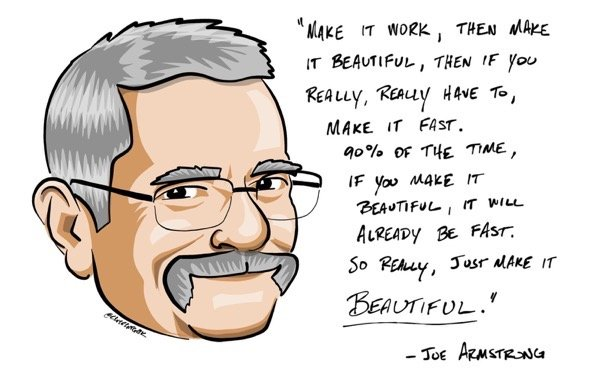

Hi! I'm Yalin, a software engineer from Izmir, Turkey.

### About
I currently work as a software crafter at [Craftbase](https://gitlab.com/craftbaseio) where I work on payment systems 💸

I previously worked at [OMMA](https://github.com/signalive) where I helped build a cloud-based digital signage platform 📺, [VNGRS](https://github.com) where I helped build a ticketless parking system 🚗, albeit for a short while, and RDC Partner where I co-built an enterprise-friendly private cloud storage platform similar to Dropbox 💾

### Programming Approach and Values
I believe that all code should be as fast, sturdy, concise, and deterministic as possible, while still being open to future changes. Since [complexity has to live somewhere](https://ferd.ca/complexity-has-to-live-somewhere.html), I'm willing to sacrifice the so called "simplicity" in order to achieve it.

As such, I'm an advocate of functional programming paradigms, and while I do understand that achieving 100% pure functional programming isn't really suited for us mere mortals, I firmly believe that we should always try to structure our programs around its core concepts (e.g. immutability, eliminating side effects, favoring composition over inheritance)

### Interests and Pet Projects
With my belief in functional programming paradigms and experience developing high-concurrency systems using traditional multithreaded programming techniques, I'm a huge fan of the actor model, and naturally, the programming languages :phone: Erlang and :alembic: Elixir.

I like spending some of my free time working on stuff related to functional programming, the actor model, or Erlang/Elixir, which I even end up finishing and releasing sometimes. Some of these WIP projects are:  
- [improv](https://github.com/ygunayer/improv) an actor model implementation for JavaScript
- [patmat](https://github.com/ygunayer/patmat) a pattern matching library for JavaScript
- [pollsterl](https://github.com/ygunayer/pollsterl) a Discord bot that you can use to create and vote on polls, written in Erlang
- [potcu](https://github.com/ygunayer/potcu) a Discord bot that you can use to "bomb" certain voice channels by having it join the channel and start playing a certain song, written in Elixir

I also like to work on video games (stereotypically the reason I got into programming), but I'm yet to finish and release one.

### Contact
🌍 [https://yalingunayer.com](https://yalingunayer.com)  
:octocat: [https://github.com/ygunayer](https://github.com/ygunayer) *📍you are here*  
🐦 [https://twitter.com/ygunayer](https://twitter.com/ygunayer)

